# React Native Share Extension

This is a helper module which brings react native as an engine to drive share extension for your app.

# Installation

installation should be very easy by just installing it from npm.

```js
npm install react-native-share-extension --save
```

# Setup

the setup requires a little bit more work. I will try to describe as detail as possible. I would love to use `rnpm` so I will welcome pull request.

## iOS

- click on your project's name
- click on `+` sign

<p align="center">
    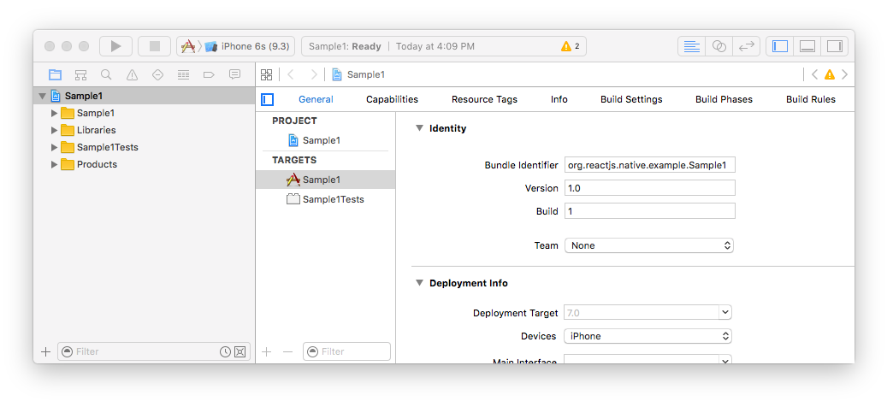
</p>

- select `Share Extension` under `iOS > Application Extension`

<p align="center">
    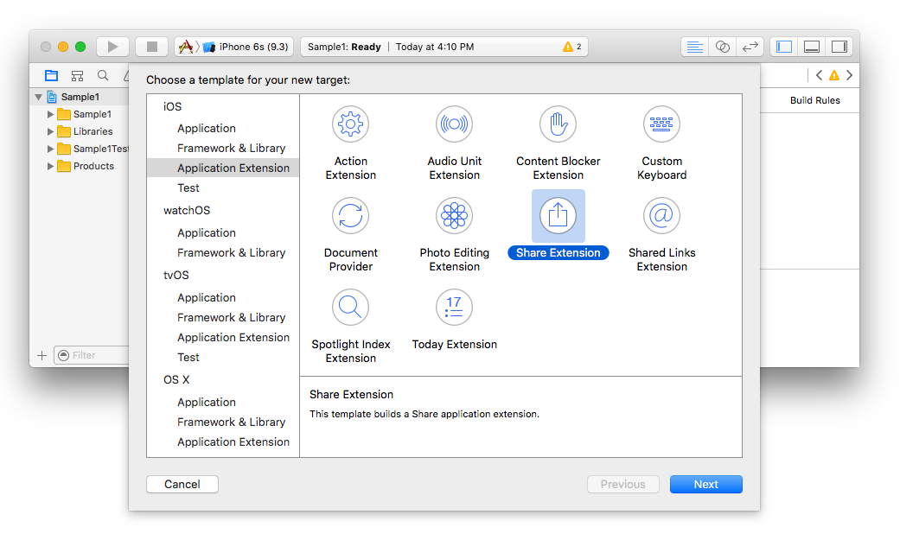
</p>

- select a name for your new share extension, in my case I chose `MyShareEx`

<p align="center">
    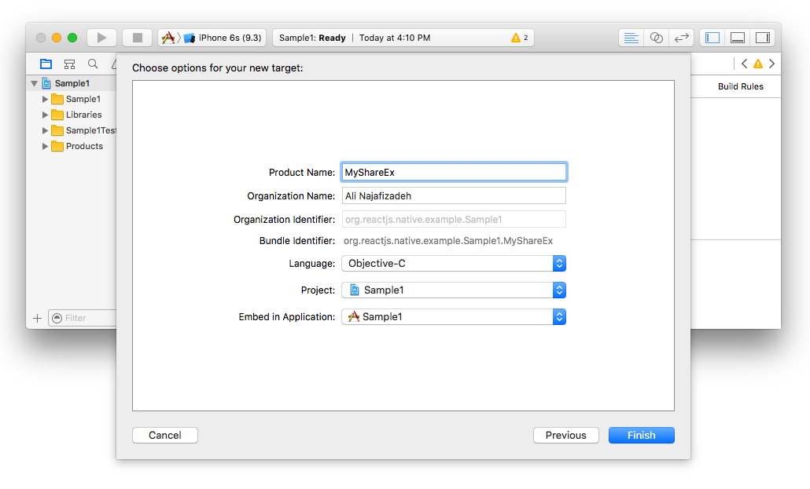
</p>

- delete both `ShareViewController.h` and `ShareViewController.m`. make sure to click on `Move to Trash` button during deletion.

<p align="center">
    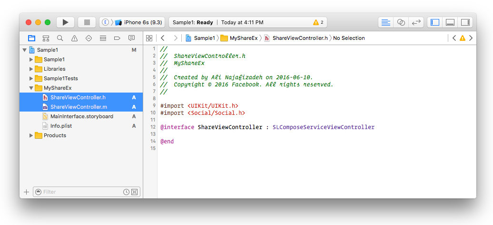
</p>

- create new file under your share extension group. in my case it was `MyShareEx`

<p align="center">
    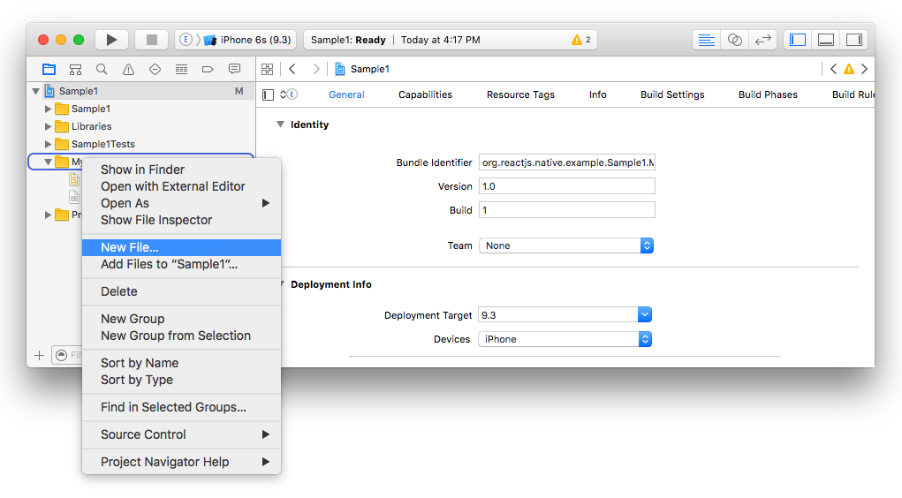
</p>

- make sure the type of that object is `Objective-c File` and name it `MyShareEx.m`

<p align="center">
    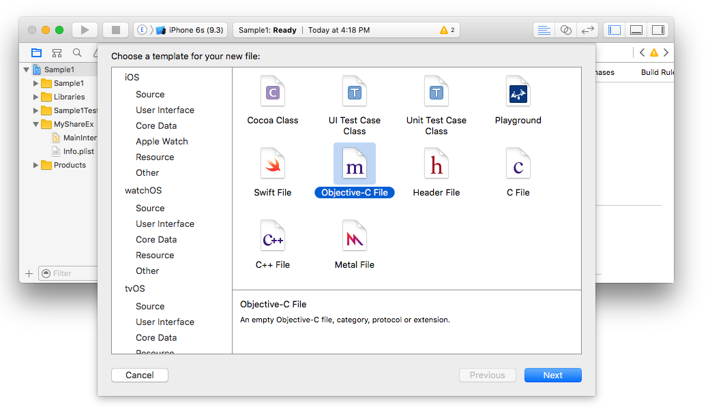
</p>

<p align="center">
    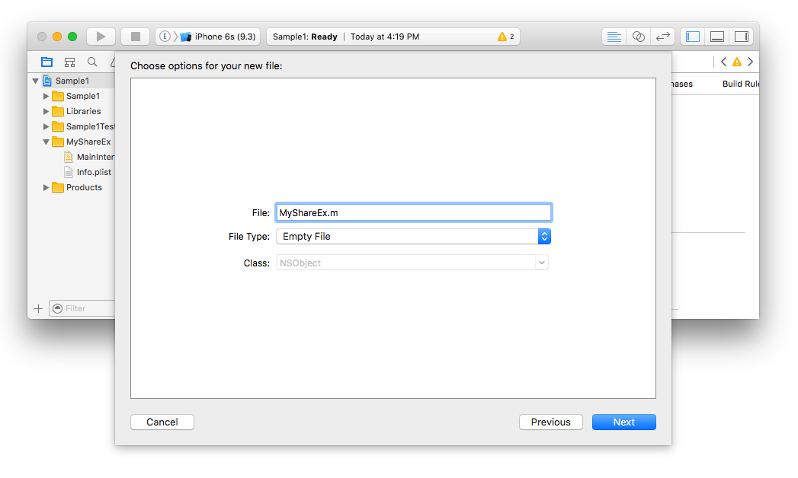
</p>

- since we deleted `ShareViewController.m`, we need to tell the storyboard of your share extension where the view needs to be loaded. So click on `MainInterface.storyboard` and replace the class field from `ShareViewController` to `MyShareEx`

<p align="center">
    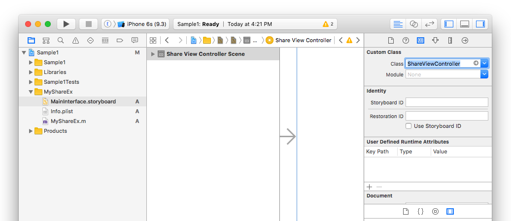
</p>

- now it's time to add our library. Right click on `Libraries` group and select `Add Files to "Sample1"...`

<p align="center">
    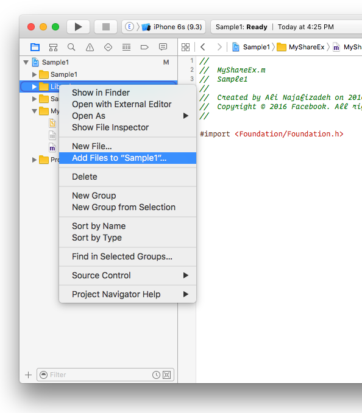
</p>

- select `node_modules` > `react-native-share-extension` > `ios` > `ReactNativeShareExtension.xcodeproj`

<p align="center">
    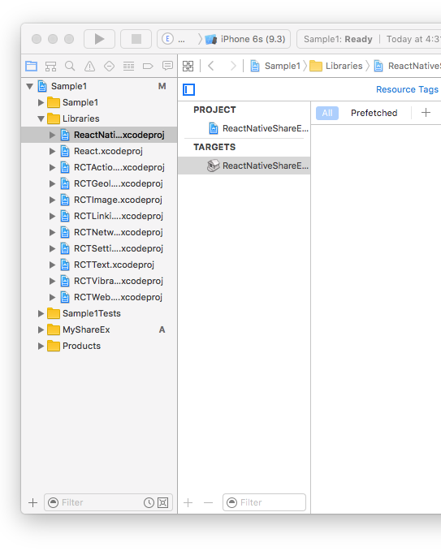
</p>

- now we need to tell the share extension that we want to read new header files. click on project name, in my case `Sample1` then click on `MyShareEx`. After that click on Build Settings and search for `Header Search Paths`

<p align="center">
    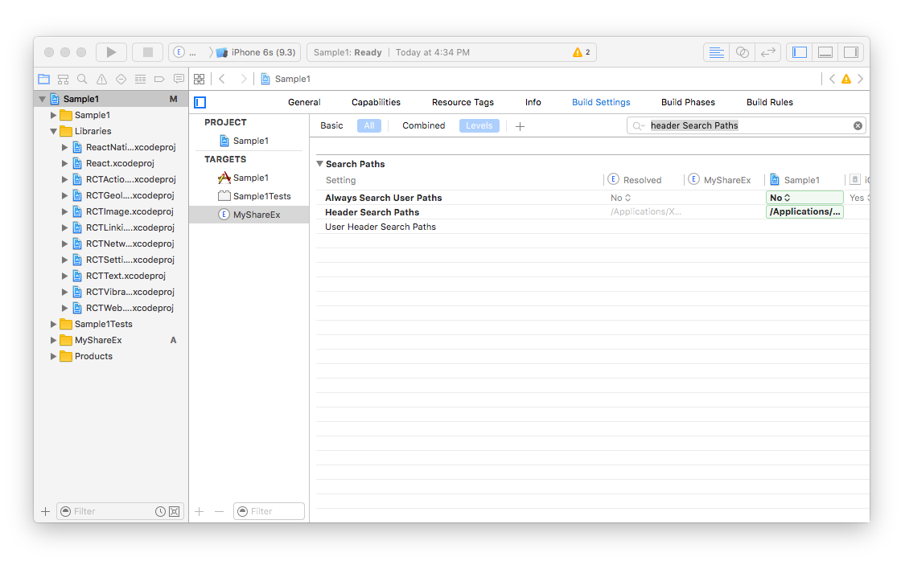
</p>

- add the new path `$(SRCROOT)/../node_modules/react-native-share-extension/ios` with `recursive` selected.

<p align="center">
    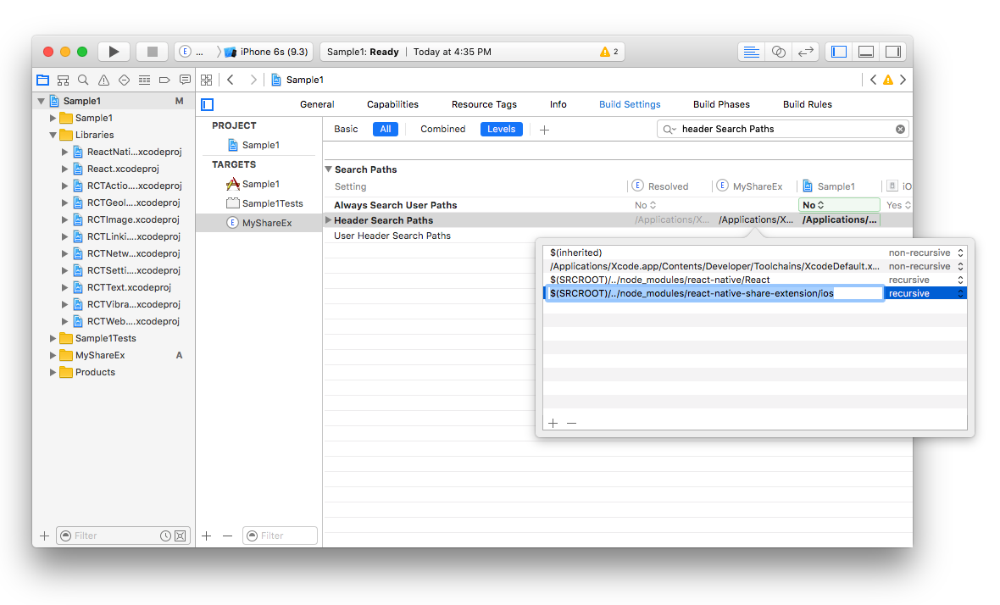
</p>

- we need to add some flags as well, so search for `Other Linker Flags` and add `-Objc` and `lc++`

<p align="center">
    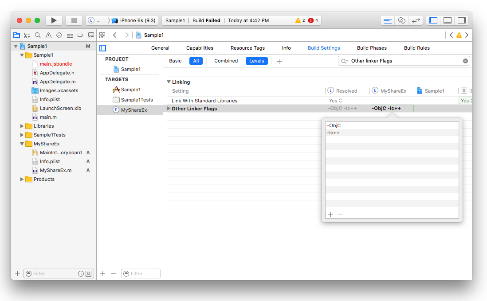
</p>

- we also need to add all the static libraries such as react and Share Extension. so select `General` tab and under `Linked frameworks and Libraries` click on `+` and add all of the selected static binaries there.

<p align="center">
    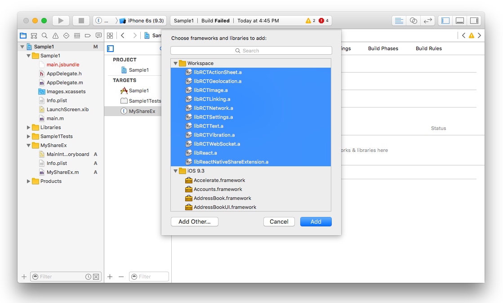
</p>

- we need to modify `MyShareEx/Info.plist` to make sure that our share extension can connect to ineternet. This is useful if you need your share extension connects to your api server or react-native remote server dev. For doing that we need to `App Transport Security Settings` to `Info.plist`

<p align="center">
    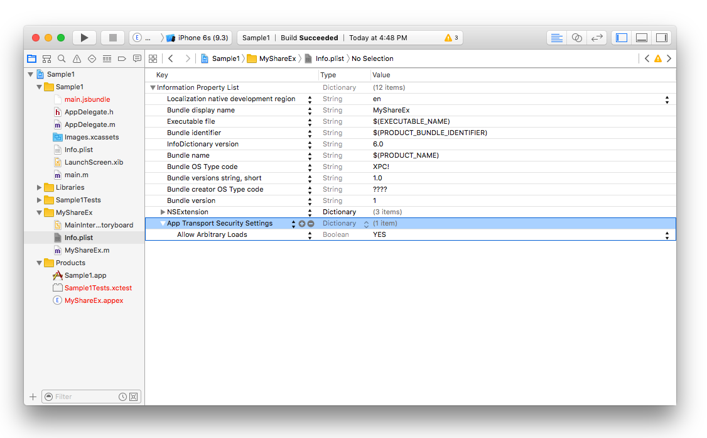
</p>

- now go back to `MyShareEx.m` and paste the following code there.

```objective-c
#import <Foundation/Foundation.h>
#import "ReactNativeShareExtension.h"
#import "RCTRootView.h"

@interface MyShareEx : ReactNativeShareExtension
@end

@implementation MyShareEx

- (UIView*) shareView {
  //this is the name of registered component that ShareExtension loads.
  NSString *myShareComponentName = @"SampleShare";

  NSURL *jsCodeLocation = [NSURL URLWithString:@"http://localhost:8081/index.ios.bundle?platform=ios&dev=true"];

  RCTRootView *rootView = [[RCTRootView alloc] initWithBundleURL:jsCodeLocation
         moduleName:myShareComponentName
  initialProperties:nil
      launchOptions:nil];
  rootView.backgroundColor = nil;
  return rootView;
}

@end
```

- now try to build the project. it should build successfully.

## Android
